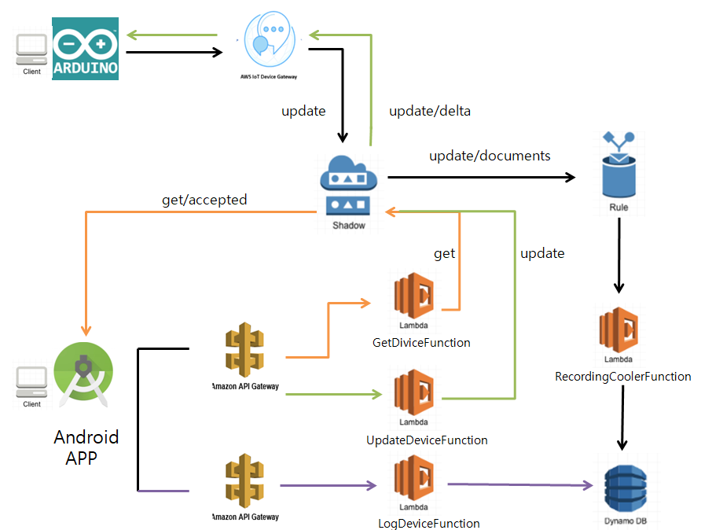
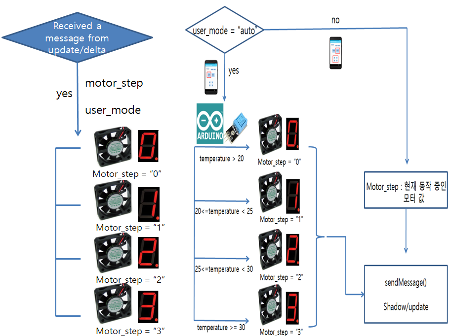
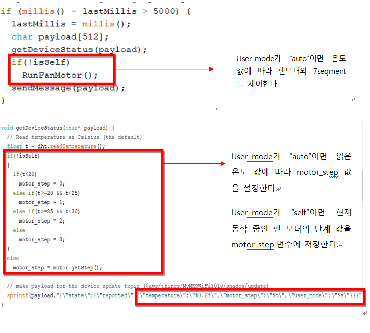

## REST API 기반 노트북 팬 모터 제어 앱

- **Anroid-RestAPI** 안드로이드 프로젝트는 **Amazon API Gateway**를 통해서 게시된 REST API를 활용하여 **IoT 벡엔드**와 상호작용하는 노트북의 온도에 따라 팬모터가 제어되는 앱입니다. 안드로이드 앱의 주요 기능은 다음과 같습니다. 
	- 노트북의 온도 및 팬모터 동작 단계 조회
	- 팬모터 자동 또는 수동 모드 및 팬모터 단계 변경
	- 노트북 온도 로그 조회(꺾은선 그래프)
	- 팬모터 동작 단계 로그 조회(원 그래프)
- **IoT 백엔드**는 AWS의 다양한 서비스(AWS IoT Core, AWS Lambda, Amazon DyanmoDB, Amazon SNS, Amazon API Gateway)를 이용해 구축된 IoT 클라우드 플랫폼입니다.
	- **AWS IoT Device gateway**를 통해서 연결된 **아두이노 디바이스**(**MKRWiFi1010**)로부터 주기적으로 매 5초마다 디바이스 정보(현재 온도, 팬모터 동작 단계, 유저 모드)를 수신하고, MQTT 프로토콜을 이용하여 **Device shadow** 혹은 **IoT rule** 컴포넌트와 상호작용합니다.
		- **Device shadow**는 **Device gateway**를 통해 게시된 주제에 따라 디바이스 상태정보를 업데이트하거나 현재 상태정보를 게시합니다.
		- **IoT rule**은 등록된 주제(update/documents)의 메시지가 수신될 때마다 **AWS Lambda** 함수를 통해서 수신된 메시지를 **Amazon DynamoDB**(DB 이름 : Logging)에 저장한다.
	- **Amazon API Gateway**는 **AWS Lambda**함수를 통해서 다음 기능을 수행하는 두 가지 REST API를 게시한다.
		- 디바이스의 정보를 변경하거나 조회하는 REST API
		- 디바이스의 로그 정보를 조회하는 REST API

	
	
	[아두이노 구조도]
	
	
	[하드웨어 구조도]
	

### 1. REST API 설계
- 다음 프로그램 코드를 실행시키기 위해서는 다음 형식의 **REST API**가 준비되어 있어야 합니다.

	- 디바이스 상태 조회

		```	
		GET /devices/{deviceId}
		```
	- 디바이스 상태 변경

		```	
		PUT /devices/{deviceId}
		```
		
		- message body (payload)
		
			```json
			{ 
				"tags" : [
					{
						"attrName": "user_mode",
						"attrValue": "self"
					},
					{
						"attrName": "motor_step",
						"attrValue": "2"
					},
					{
						"attrName" : "temperature",
						"attrValue" : "24"
					}
				]
			}

	
	- 디바이스 로그 조회	

		```		
		GET /devices/{deviceId}/log?from=yyyy-mm-dd hh:mm:ss&to=yyyy-mm-dd hh:mm:ss
		```
		
### 2. AWS IoT 백엔드 구축

다음 방법을 통해서 다음 IoT 백엔드를 구축한다.

1. [AWS IoT와 아두이노 연결하기](https://kwanulee.github.io/IoTPlatform/start-aws-iot.html#2)

(위 링크와 다른 주요 부분)
	iot 사물 이름 : **MyFanCooler**
	


	


2. [디바이스 데이터 저장 IoT 백엔드 구축](https://kwanulee.github.io/IoTPlatform/dynamodb.html#4)

(위 링크와 다른 주요 부분)

3. [디바이스 상태 조회 REST API 구축](https://kwanulee.github.io/IoTPlatform/api-gateway-3.2.html)

(위 링크와 다른 주요 부분)

4. [디바이스 상태 변경 REST API 구축](https://kwanulee.github.io/IoTPlatform/api-gateway-3.3.html)

(위 링크와 다른 주요 부분)

5. [디바이스 로그 조회 REST API 구축](https://kwanulee.github.io/IoTPlatform/api-gateway-3.4.html)

(위 링크와 다른 주요 부분)

### 3. Android 앱 설치 및 실행
- 설치 방법
	- **Clone or download** 를 클릭 후, Download ZIP을 통해 프로젝트 zip파일을 다운 받아서 압축을 푼 후에, AndroidStudio를 통해 실행 시킵니다.
	
	

- 초기 실행 화면


- 로그 조회 화면(온도 값)


- 로그 조회 화면(모터 단계 값)


- 아래 세가지 버튼을 클릭하기 전에 API URI를 입력해야 합니다.
	- Amazon API Gateway로 부터 만들어진  API 서버 URL을 기록해 둔다. 
		
		```
		https://xxxxxxxx.execute-api.ap-northeast-2.amazonaws.com/prod 
		```
	- 사물목록 조회 API URI
		
		```
		https://xxxxxxxx.execute-api.ap-northeast-2.amazonaws.com/prod/devices
		```
	
	- 사물상태 조회/변경 API URI

		```
		https://xxxxxxxx.execute-api.ap-northeast-2.amazonaws.com/prod/devices/{devices_name}
		```
	- 사물로그 조회 API URI

		```
		https://xxxxxxxx.execute-api.ap-northeast-2.amazonaws.com/prod/devices/{devices_name}/log
		```	
